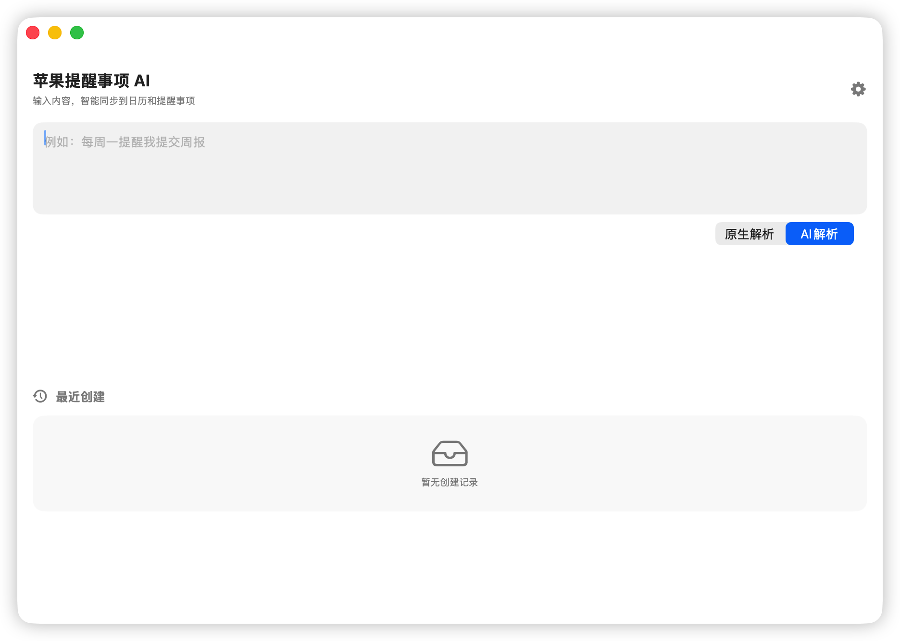
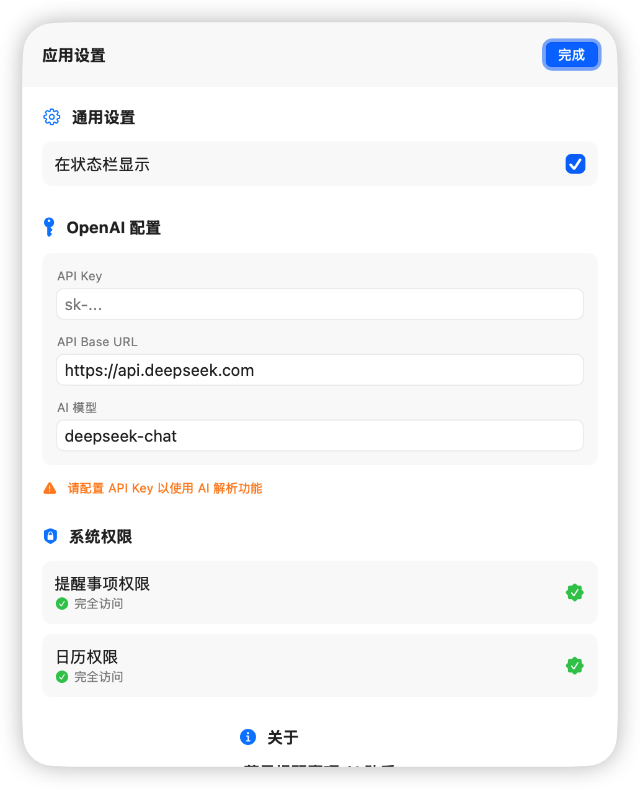

# 苹果提醒事项 AI 助手

<p align="center">
  
  
  
</p>

一款 macOS 原生应用，支持通过自然语言快速创建提醒事项和日历事件。支持原生系统解析和 OpenAI API 智能解析两种模式。

## ✨ 功能特性

- 🗣️ **自然语言输入** - 使用日常语言描述任务，自动识别时间、日期和周期
- 🔄 **双模式解析** - 支持原生系统解析（离线可用）和 AI 智能解析
- 📅 **日历事件** - 智能识别会议、活动等，创建日历事件
- ⏰ **提醒事项** - 识别待办任务，创建提醒事项
- 🔁 **周期设置** - 支持每天、每周、每月等重复周期
- 🗂️ **自动分组** - 根据事项语义和用户已有列表/日历自动选择目标分组，不创建陌生分组
- 🔔 **精确提醒** - 支持全天/定时识别、提前分钟数、工作日及自定义重复间隔
- 📝 **批量创建** - 一次输入可解析多个事项，支持批量创建并显示进度（如 3/8）
- ↩️ **历史管理** - 创建失败项可重试，已创建事项支持撤销（重复事件撤销前确认影响范围）
- 🎨 **原生体验** - 100% SwiftUI 开发，完美融入 macOS 生态
- 🔔 **状态栏支持** - 可在状态栏快速访问
- 🌐 **中英文输入** - 原生解析同时支持中文和英文表达

## 📝 支持的输入语法

**时间与日期**
- `明天下午3点提醒我开会`、`每周一提交周报`、`周五9:30晨会`
- `30分钟后提醒我喝水`、`两小时后复查构建`、`3天后交报告`
- `2027年3月5日交年度总结`、`下个月15号还信用卡`、`月底完成报销`

**重复规则**
- `每天` / `工作日` / `每周` / `每两周` / `每月` / `每年` / `每3天`
- `每月15号还信用卡`（每月指定日期）
- `每年3月5日体检`（每年指定月日）
- `每月最后一个周五复盘`、`每月第二个周二例会`（每月第 N 个星期几）

**优先级与备注**
- `！！！` 高优先级、`！！` 中、`！` 低；`紧急` → 高、`重要` → 中
- 括号内容自动作为备注：`明天开会（带笔记本电脑）`
- `备注：` 后的内容作为备注：`提醒我取快递 备注：到付`

**英文输入（原生解析同样支持）**
- `remind me to buy milk tomorrow at 9am`
- `team meeting every monday at 3pm`
- `pay rent on the 15th of every month`、`the last friday of every month`

**AI 解析模式**
- 429 限流与瞬时网络错误自动指数退避重试
- 解析中可随时取消（取消按钮 / Esc），慢网络不必干等超时

## 📸 截图

<p align="center">
  
  
</p>

## 🛠️ 系统要求

- macOS 14.0 (Sonoma) 或更高版本
- Xcode 15.0 或更高版本（用于编译）

## 📦 安装

### 从源码编译

1. 克隆仓库
```bash
git clone https://github.com/yourusername/AppleReminderAI.git
cd AppleReminderAI
```

2. 使用 Xcode 打开项目
```bash
open AppleReminderAI-xcode.xcodeproj
```

3. 选择你的开发团队并编译运行

### 📦 本地打包与发布

- **本地快速打包 DMG**：执行 `make package`（详见 [local_pack.md](local_pack.md)）
- **GitHub 自动化发布**：向仓库推送 `v*` Tag 或在 GitHub 页面发布 Release 时，GitHub Actions 会自动编译并发布 `arm64` 与 `x86_64` 两个架构的 DMG 安装包。


## 🚀 使用方法

### 基本使用

1. 在输入框中输入自然语言描述的任务
   - 例如：`明天早上10点提醒我开会`
   - 例如：`每周一提交周报`
   - 例如：`下午3点到5点项目评审会议`

2. 选择解析模式：
   - **原生解析**：使用系统内置的自然语言处理，离线可用
   - **AI 解析**：使用 OpenAI API 进行智能解析，需配置 API Key

3. 确认解析结果后，点击创建按钮

解析结果支持逐项修改标题、备注、日期、全天状态、提醒偏移、重复规则和目标列表/日历。自动分组仅会匹配当前账户中已有且允许修改的分组；无法可靠判断时使用系统默认分组。

### 配置 AI 解析

1. 点击设置图标进入设置页面
2. 在 OpenAI 配置中填入：
   - API Key
   - API Base URL（支持自定义端点）
   - 模型名称（默认使用 gpt-4o-mini）

## 📁 项目结构

```
AppleReminderAI-xcode/
├── AppleReminderAIApp.swift    # 应用入口
├── Models/                      # 数据模型
│   ├── AppSettings.swift       # 应用设置
│   ├── AppStrings.swift        # 用户可见文案集中管理
│   ├── AppConstants.swift      # 共享常量（通知名等）
│   └── ParsedItem.swift        # 解析结果模型
├── Views/                       # 视图层
│   ├── MainView.swift          # 主界面
│   ├── SettingsView.swift      # 设置界面
│   ├── ParsedItemsListView.swift # 解析结果列表
│   └── HistoryView.swift       # 历史记录
├── ViewModels/                  # 视图模型
│   └── MainViewModel.swift     # 主视图模型
├── Services/                    # 服务层
│   ├── NLPParser.swift         # 原生解析器（中英文）
│   ├── OpenAIParser.swift      # AI 解析器（可取消 + 自动重试）
│   ├── ScheduleNormalizer.swift # 日期、提醒和重复规则归一化
│   ├── GroupClassifier.swift   # 自动匹配提醒列表/日历
│   ├── EventKitRecurrenceBuilder.swift # EventKit 重复规则构建
│   ├── KeychainStore.swift     # API Key 安全存储
│   ├── ReminderService.swift   # 提醒事项服务
│   ├── CalendarService.swift   # 日历服务
│   └── PermissionManager.swift # 权限管理
├── Assets.xcassets/            # 资源文件
Tests/                           # 单元测试（swift test 运行）
└── Package.swift               # 本地测试用 SPM 清单（不影响 Xcode 构建）
```

### 运行单元测试

解析器、归一化、分组和重复规则等纯逻辑配有单元测试：

```bash
swift test
```

## 🔒 隐私与权限

应用需要以下权限：
- **提醒事项访问权限** - 用于创建提醒事项
- **日历访问权限** - 用于创建日历事件

事项历史和常规设置保存在本地，API Key 存储在 macOS 钥匙串中。AI 解析模式下，输入内容以及现有提醒列表/日历名称会发送至配置的 API 端点；远程端点必须使用 HTTPS，本机 localhost 服务可使用 HTTP。

## 🤝 贡献

欢迎提交 Issue 和 Pull Request！

## 📄 许可证

本项目采用 MIT 许可证 - 详见 [LICENSE](LICENSE) 文件

## 👨‍💻 作者

**mao.tao**

---

如果这个项目对你有帮助，请给一个 ⭐️ Star！
